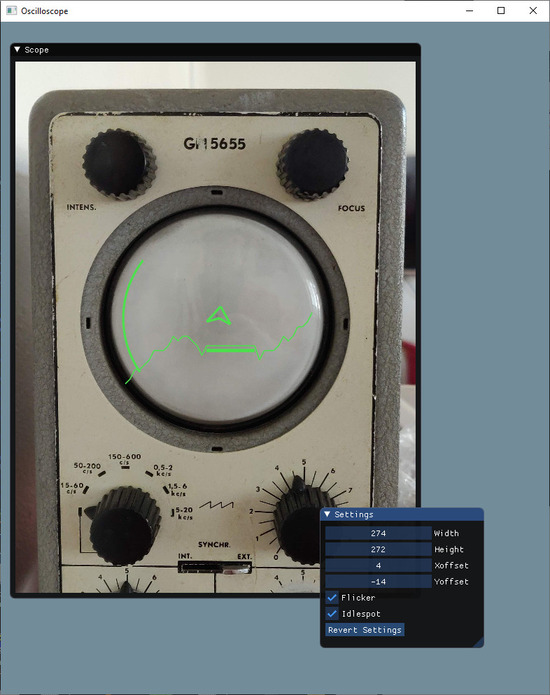
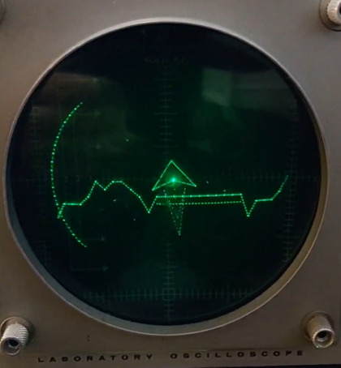
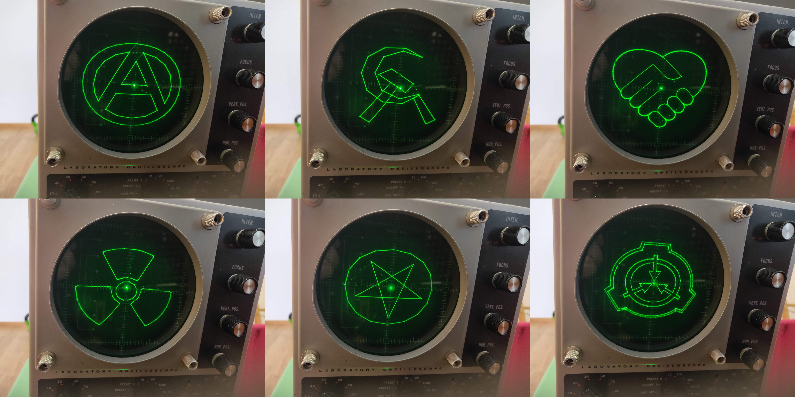
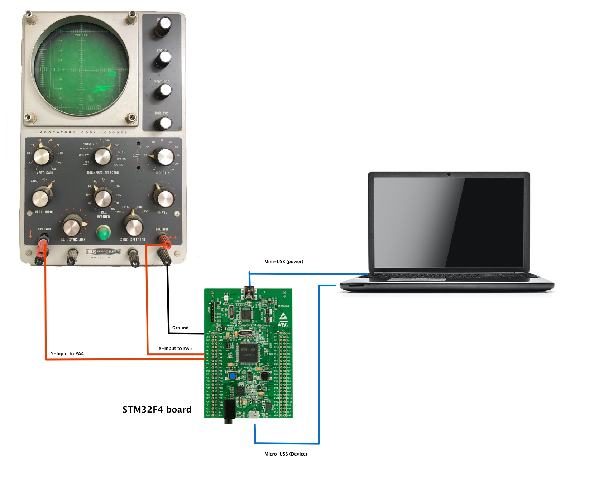

# AudioRender
Audio Render API for Oscilloscope X/Y mode

Requires Visual Studio 2017 or later.

## Quickstart

1. Generate project files with CMake.

2. Build

3. Run at build folder bin directory: 

   `AudioRenderAPITest.exe /S /D 1`.
   
  This opens simulated window for demo 1. Try out also demo 2 and 3.

Example render running on simulated view and on a analogue Oscilloscope (GM5655)

LunarLander Game 

SVG renderings on Oscilloscope

[DACDriver](https://github.com/tikonen/DACDriver) firmware implements a virtual soundcard on STM32F4 MCU. It can be used for more accurate analog signal control. Sound cards have tendency for ringing and overshoots in non-continous signals.

